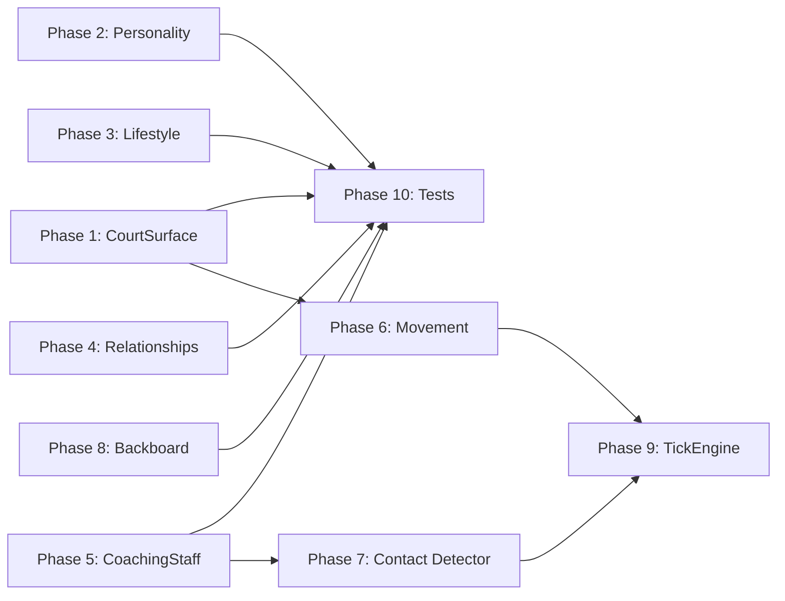

# Dead Code Integration Plan

Wire every unused-but-implemented system into the game simulator. Each phase is an independent, testable change.

---

## Phase 1: CourtSurface + Arena

**What exists:** [`CourtSurface`](src/hoops_sim/physics/court_surface.py:35) with traction, altitude stamina drain, ball bounce modifiers, slip probability. [`Arena`](src/hoops_sim/models/arena.py:11) with home court advantage. Pre-built surfaces for Denver and Miami.

**Integration points in `simulator.py`:**

1. **`__init__`** -- Read `home_team.arena.surface` and store as `self.surface`
2. **`_drain_energy_for_ticks()`** -- Multiply drain by `surface.get_stamina_drain_modifier()` for visiting team. Denver's 5,280ft altitude means ~3% faster stamina drain for visitors.
3. **`_execute_dribble_move()`** -- Check `surface.get_slip_probability()`. On slip: turnover + injury risk check.
4. **`_execute_drive()`** -- Same slip check on high-intensity cuts.
5. **`_setup_possession()`** -- Apply `arena.home_court_advantage()` as a modifier stored for the possession.

**New constants needed:** None -- already defined in `constants.py`.

---

## Phase 2: PlayerPersonality

**What exists:** [`PlayerPersonality`](src/hoops_sim/models/personality.py:15) with ego, temperament, competitiveness, coachable, alpha_mentality. Methods: `tech_foul_tendency()`, `is_volatile()`, `chemistry_impact()`.

**Integration points:**

1. **`_foul_on_drive()` / foul events** -- After any foul call, check fouled player's `personality.tech_foul_tendency()`. Roll for technical foul (complaining to refs). This uses the existing `temperament` and `ego` fields.
2. **`ConfidenceTracker`** -- Volatile players (`is_volatile()`) get 1.5x confidence swings (both positive and negative). Calm players get 0.7x swings.
3. **`_process_ball_handler_tick()`** -- High-ego players (`ego > 0.7`) bias toward shooting over passing when shot quality is marginal. Override the early-possession pass bias for alpha players.
4. **Coach decisions** -- Players with low `coachable` have a chance to ignore play calls (take a different action than what the play assigned).

---

## Phase 3: PlayerLifestyle

**What exists:** [`PlayerLifestyle`](src/hoops_sim/models/lifestyle.py:9) with sleep_quality, nutrition, personal_life, media_pressure. Methods: `daily_recovery_modifier()`, `game_day_focus()`, `injury_risk_modifier()`.

**Integration points:**

1. **`__init__`** -- Apply `lifestyle.game_day_focus()` as a starting energy modifier. Players with bad lifestyle start at 95-100% energy instead of 100%.
2. **`_drain_energy_for_ticks()`** -- Multiply bench recovery by `lifestyle.daily_recovery_modifier()`. Poor sleep/nutrition = slower bench recovery.
3. **Injury checks** -- If injury system is called, multiply risk by `lifestyle.injury_risk_modifier()`. Poor nutrition + poor sleep = +10% injury risk.

---

## Phase 4: RelationshipMatrix

**What exists:** [`RelationshipMatrix`](src/hoops_sim/models/relationships.py:69) with per-pair affinity and trust. Methods: `on_court_passing_mod()`, `on_court_screen_mod()`, `on_court_help_defense_mod()`.

**Integration points:**

1. **`_execute_pass()`** -- Look up `team.relationships.get(passer_id, receiver_id).on_court_passing_mod()`. Apply as steal probability modifier: high trust = harder to intercept. Range: -10% to +10% on pass success.
2. **`_execute_screen()`** -- Look up screener-handler relationship. Apply `on_court_screen_mod()` to `screen_result.separation_created`. Trusted screener = better screen.
3. **`_decide_defensive_action()`** -- Apply `on_court_help_defense_mod()` to help defense trigger threshold. High trust = defender helps sooner.
4. **Post-possession updates** -- On assist: `modify_trust(passer, scorer, +1)`. On turnover from bad pass: `modify_affinity(passer, intended_target, -1)`.

---

## Phase 5: CoachingStaff

**What exists:** [`CoachingStaff`](src/hoops_sim/models/coaching_staff.py:21) with offensive_scheme, defensive_scheme, game_management, conditioning_coach, and `CoachPersonality` enum.

**Integration points:**

1. **`_select_play()`** -- Coach personality affects play selection weights:
   - AGGRESSIVE: more fast breaks, blitzes
   - DEFENSIVE: more motion offense, fewer ISOs
   - OFFENSIVE: more pick-and-roll, isolation
   - OLD_SCHOOL: more post-ups
2. **`_check_coach_decisions()` (timeouts)** -- `game_management` rating affects timeout quality. Higher rating = better timeout trigger logic (call timeout on 8-0 runs instead of waiting for 12-0).
3. **`_drain_energy_for_ticks()`** -- `conditioning_coach` rating affects energy drain rate. Good conditioning coach = 5% slower energy drain for all players.
4. **Defensive scheme** -- `defensive_scheme` rating adds a flat modifier to all defensive contest quality.

---

## Phase 6: Movement Module Integration

**What exists:** [`movement/off_ball.py`](src/hoops_sim/movement/off_ball.py:37) with `calculate_spot_up_position()`, `calculate_cut_target()`. [`movement/defensive_movement.py`](src/hoops_sim/movement/defensive_movement.py:35) with `calculate_on_ball_position()`, `calculate_help_position()`, `calculate_closeout_position()`. [`movement/locomotion.py`](src/hoops_sim/movement/locomotion.py:24) with `execute_movement()`, `choose_movement_type()`.

**Integration points:**

1. **`_find_spot_up_position()`** -- Replace with call to `off_ball.calculate_spot_up_position()`. The existing inline logic duplicates what `off_ball.py` already does.
2. **`_decide_off_ball_action()`** -- Use `calculate_cut_target()` for cut targets instead of hardcoded `basket` position.
3. **`_decide_defensive_action()`** -- Replace inline guard position calculation with `calculate_on_ball_position()`, `calculate_help_position()`.
4. **`_tick_all_players()`** -- Use `locomotion.choose_movement_type()` instead of `_intent_to_movement_type()`. Use `locomotion.execute_movement()` for the actual position update.

---

## Phase 7: Contact Detector

**What exists:** [`engine/contact_detector.py`](src/hoops_sim/engine/contact_detector.py:28) with `detect_contacts()` that checks all player proximities and generates `ContactEvent` objects with severity classification.

**Integration points:**

1. **`_tick_all_players()`** -- After updating all positions, call `detect_contacts()` with offense and defense states.
2. **Process returned `ContactEvent` list** -- For each contact:
   - Feed to [`RefereeCrew`](src/hoops_sim/referee/foul_judge.py:24) for foul adjudication
   - If foul called, handle free throws / possession change
   - If no foul, apply contact effect (slight slowdown, possible injury check)
3. **Remove inline foul probability** from `_execute_drive()` and `_execute_post_up()` -- replace with contact-detector-driven fouls.

---

## Phase 8: Backboard Physics

**What exists:** [`physics/backboard.py`](src/hoops_sim/physics/backboard.py:32) with `check_backboard_hit()` that calculates ball reflection off the backboard glass.

**Integration points:**

1. **`_execute_shot()`** -- After `resolve_rim_interaction()` returns a BACKBOARD outcome, call `check_backboard_hit()` to determine if the ball banks in or misses.
2. **Bank shot detection** -- Shots from certain angles with certain spin should route through backboard physics first. The existing `rim_interaction.py` already has a `resolve_backboard_interaction()` function -- ensure the full `backboard.py` geometry check feeds into it.

---

## Phase 9: TickEngine

**What exists:** [`engine/tick.py`](src/hoops_sim/engine/tick.py:58) `TickEngine` with `process_tick()` that handles clock advancement, shot clock violations, and quarter end detection.

**Integration points:**

1. **`_simulate_possession()` inner loop** -- Replace the inline clock/shot-clock/quarter-end logic with `TickEngine.process_tick()`. The tick engine already handles:
   - Clock advancement when ball is live
   - Shot clock violation detection
   - Quarter end detection
2. **`_advance_clock()` + `_check_quarter_end()`** -- These two methods are what `TickEngine.process_tick()` already does. Replace them.
3. **Store TickEngine as `self.tick_engine`** in `__init__`.

---

## Phase 10: Tests

Each phase gets corresponding tests:

- Phase 1: Test that Denver altitude increases energy drain; test slip probability on worn court
- Phase 2: Test that volatile players get tech fouls; test ego affects shot selection
- Phase 3: Test that poor lifestyle reduces bench recovery
- Phase 4: Test that high-trust pairs have better pass completion
- Phase 5: Test that aggressive coach picks more fast breaks
- Phase 6: Test that movement module positions match expected court geometry
- Phase 7: Test that driving contact generates foul events
- Phase 8: Test that bank shots route through backboard physics
- Phase 9: Test that TickEngine produces same quarter-end detection as inline code

---

## Execution Order

Phases 1-5 are additive (wire new modifiers into existing logic) and can be done in any order. They're the safest because they only ADD influence -- they don't replace existing logic.

Phases 6-9 are substitutive (replace inline logic with module calls) and carry more risk. They should be done after 1-5, with careful test coverage.

Phase 10 runs alongside each phase.

