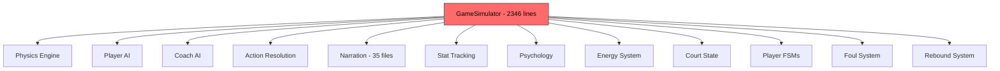
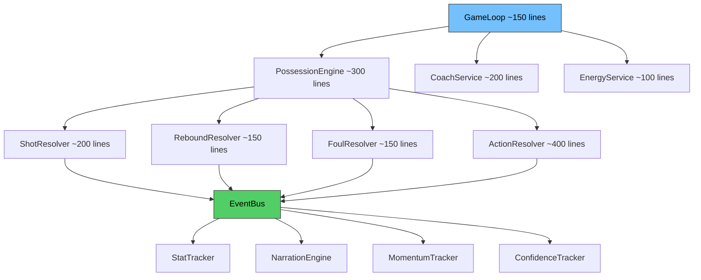

# hoops.sh: Why This Is How You Should NOT Build a Big Project

## Executive Summary

hoops.sh is an ambitious basketball simulation engine with impressive domain modeling -- 60+ player attributes, 3D ball physics, a 7-layer narration pipeline, and a full TUI. But its architecture has fundamental structural problems that would make it increasingly painful to maintain, extend, test, and debug as it grows. The core issue: **the project's complexity lives in the wrong places, and the boundaries between systems are either missing or drawn incorrectly.**

---

## Problem 1: The 2,346-Line God Object

The single biggest red flag is [`GameSimulator`](src/hoops_sim/engine/simulator.py:160). This one class:

- Runs the game loop
- Manages the clock and quarters
- Handles player AI decisions
- Executes dribble moves, passes, screens, drives, shots, post-ups
- Resolves rebounds
- Adjudicates fouls and free throws
- Manages energy/fatigue
- Runs coach AI for substitutions and timeouts
- Emits narration events
- Triggers crowd reactions
- Manages court positions and player FSMs
- Evaluates transition opportunities

It has **28+ methods** and imports from **30+ modules**. The constructor alone initializes 15+ subsystems. This is the classic "God Object" anti-pattern -- one class that knows about and orchestrates everything.

**Why this hurts:**
- Any change to any game mechanic risks breaking unrelated mechanics
- You can't test shot resolution without constructing the entire simulator
- Two developers can't work on "rebounds" and "screens" without merge conflicts
- The mental model required to understand this file is enormous

**The import list tells the story:**

```python
from hoops_sim.actions.dribble import ...
from hoops_sim.actions.finishing import ...
from hoops_sim.actions.passing import ...
from hoops_sim.actions.screen import ...
from hoops_sim.ai.coach_brain import ...
from hoops_sim.ai.player_brain import ...
from hoops_sim.court.driving_lanes import ...
from hoops_sim.court.model import ...
from hoops_sim.court.passing_lanes import ...
from hoops_sim.court.zones import ...
from hoops_sim.defense.pnr_coverage import ...
from hoops_sim.engine.action_fsm import ...   # 7 symbols
from hoops_sim.engine.court_state import ...  # 4 symbols
from hoops_sim.engine.game import ...
from hoops_sim.engine.possession import ...
from hoops_sim.engine.situational import ...
from hoops_sim.engine.transition import ...
from hoops_sim.narration.broadcast_mixer import ...
from hoops_sim.narration.chain_composer import ...
from hoops_sim.narration.clock_narrator import ...
from hoops_sim.narration.color_commentary import ...
from hoops_sim.narration.engine import ...
from hoops_sim.narration.events import ...    # 20+ symbols!
from hoops_sim.narration.game_memory import ...
from hoops_sim.narration.narrative_arc import ...
from hoops_sim.narration.pacing import ...
from hoops_sim.narration.play_by_play import ...
from hoops_sim.narration.possession_narrator import ...
from hoops_sim.narration.segments import ...
from hoops_sim.narration.stat_tracker import ...
from hoops_sim.physics.kinematics import ...
from hoops_sim.physics.vec import ...
from hoops_sim.plays.playbook import ...      # 6 symbols
from hoops_sim.psychology.confidence import ...
from hoops_sim.psychology.momentum import ...
from hoops_sim.shot.probability import ...
from hoops_sim.utils.constants import ...
from hoops_sim.utils.math import ...
from hoops_sim.utils.rng import ...
```

That is ~40 import lines pulling in ~80+ symbols. This single file depends on nearly every module in the project.

---

## Problem 2: Mismatched Engineering Investment

The narration system has a beautifully layered architecture with formal protocols:

```
SimEvent -> EnrichedEvent -> SequenceTag -> DramaticPlan
-> Clause -> GrammarClause -> StyledClause -> str
```

Seven layers, each with a Protocol interface in [`protocols.py`](src/hoops_sim/narration/protocols.py:26), default implementations, and the ability to swap any layer. This is proper software architecture.

Meanwhile, the actual game simulation -- the core product -- is a single monolithic class with no interfaces, no protocols, no swappable components, and no clear boundaries. The narration system got the architecture that the simulation engine needed.

**35 narration files** with clean separation vs. **1 simulator file** doing everything. The complexity budget was spent on prose generation instead of the game engine.

---

## Problem 3: No Event-Driven Decoupling

The project has an [`EventStream`](src/hoops_sim/events/event_stream.py:43) class and rich [`GameEvent`](src/hoops_sim/events/game_events.py:29) types. But the simulator doesn't use them for decoupling. Instead, it directly calls:

```python
self.scoreboard.record_basket(...)
self.confidence.on_made_shot(...)
self.momentum.on_home_score(...)
self.broadcast_stats.on_made_shot(...)
self._broadcast_event(ShotResultEvent(...))
```

Every subsystem is manually poked by the simulator. If you add a new system that cares about made baskets -- say, a fatigue recovery system or a hot-hand tracker -- you must edit the simulator. This is the opposite of the Open/Closed Principle.

---

## Problem 4: Duplicated and Conflicting Types

The codebase defines the same concepts in multiple places:

- [`ShotOutcome`](src/hoops_sim/engine/simulator.py:131) in `simulator.py` AND [`ShotOutcome`](src/hoops_sim/physics/rim_interaction.py:32) in `rim_interaction.py` -- different enums with different values
- [`ScreenResult`](src/hoops_sim/actions/screen.py:30) in `actions/screen.py` AND [`ScreenResult`](src/hoops_sim/events/game_events.py:133) in `events/game_events.py`
- [`VerbosityLevel`](src/hoops_sim/broadcast/pacing/verbosity_scorer.py:16) in `broadcast/pacing/` AND [`VerbosityLevel`](src/hoops_sim/narration/broadcast_mixer.py:29) in `narration/broadcast_mixer.py`
- [`PassResult`](src/hoops_sim/actions/passing.py:25) in `actions/passing.py` AND [`PassResult`](src/hoops_sim/events/game_events.py:147) in `events/game_events.py`
- [`DefenderState`](src/hoops_sim/engine/action_fsm.py:52) as an FSM enum AND [`DefenderState`](src/hoops_sim/narration/characters.py:14) as a narration dataclass

This creates confusion about which type to use and where the canonical definition lives.

---

## Problem 5: Magic Numbers Throughout the Simulator

The [`constants.py`](src/hoops_sim/utils/constants.py:1) file is well-organized, but the simulator is riddled with inline magic numbers:

```python
if def_dist < 5.0 and self._rng.random() < 0.4:     # What is 5.0? 0.4?
if ticks_elapsed < 30 and shot_clock_pct > 0.5:      # Why 30? Why 0.5?
if self._rng.random() < 0.50:                         # 50% what?
if player.attributes.shooting.three_point > 65:       # Why 65?
if player.body.weight_lbs > 200 and roll < 0.20:     # Why these thresholds?
```

The constants file covers physics and court dimensions but none of the gameplay tuning. Every gameplay tweak requires reading through 2,346 lines to find the right number.

---

## Problem 6: Massive Dead Code -- Elaborately Built, Never Plugged In

The codebase is full of systems that were lovingly designed and implemented but are **never called by any active code path**. The worst offenders:

**[`CourtSurface`](src/hoops_sim/physics/court_surface.py:35) -- Shoe grip estimation based on arena humidity**

This file models shoe traction coefficients, humidity-based grip penalties, altitude effects on stamina drain, ball bounce modifiers, and slip probability. It even has pre-configured surfaces for Denver (5,280 ft altitude) and Miami (65% humidity). None of its methods -- `get_traction()`, `get_slip_probability()`, `get_stamina_drain_modifier()`, `get_ball_bounce_modifier()` -- are called by the simulator or any active game logic. The only references are from `Arena` (which is also unused by the sim) and `physics/__init__.py` re-exports.

**[`TickEngine`](src/hoops_sim/engine/tick.py:58) -- The "master tick loop"**

The docstring says it "drives the simulation." Nothing imports it. The simulator has its own tick loop hardcoded inline.

**[`movement/`](src/hoops_sim/movement/) -- Three files of off-ball and defensive movement**

`off_ball.py`, `defensive_movement.py`, and `locomotion.py` define sophisticated movement commands and calculations. Zero imports from any other module. The simulator reimplements this logic inline.

**[`engine/contact_detector.py`](src/hoops_sim/engine/contact_detector.py:17) -- Contact detection**

Defines `ContactCheck` and `detect_contacts()`. Never imported by the simulator. Contact/fouls are handled by inline probability checks instead.

**[`BackboardContact`](src/hoops_sim/physics/backboard.py:18) -- Backboard physics**

Full backboard reflection physics with `check_backboard_hit()`. The rim interaction module references backboard *outcomes* but the actual `backboard.py` module's `check_backboard_hit()` function is never called from the game loop.

**Team infrastructure models -- built but never read by the engine:**

The simulator never accesses any of these, despite them being fully defined and attached to the `Team` model:
- [`Arena`](src/hoops_sim/models/arena.py:11) -- with altitude, crowd intensity, court surface
- [`Owner`](src/hoops_sim/models/owner.py:9) -- with spending willingness, patience
- [`FrontOffice`](src/hoops_sim/models/front_office.py:19) -- with scouting, development ratings
- [`CoachingStaff`](src/hoops_sim/models/coaching_staff.py:21) -- with personality archetypes
- [`PlayerLifestyle`](src/hoops_sim/models/lifestyle.py:9) -- sleep, diet, partying habits
- [`PlayerPersonality`](src/hoops_sim/models/personality.py:15) -- competitiveness, ego, coachability
- [`RelationshipMatrix`](src/hoops_sim/models/relationships.py:69) -- teammate chemistry

The engine reads `player.attributes`, `player.tendencies`, and `player.body` -- and ignores everything else. These models exist only in the data layer, never influencing a single simulation outcome.

**[`off_court/`](src/hoops_sim/off_court/__init__.py:1) -- Empty package**

An entire package directory with just an empty `__init__.py`. Placeholder for a feature that was never built.

**The pattern:** The project was designed top-down as a specification -- "what would a perfect basketball sim need?" -- and then modules were built to that spec without verifying they'd actually be wired into the engine. The result is an impressive-looking file tree where perhaps 30-40% of the code does nothing.

---

## Problem 7: Two Parallel Narration Systems (continued dead code)

The codebase contains two complete narration systems:

1. **Old system**: [`narration/engine.py`](src/hoops_sim/narration/engine.py:87) with `NarrationEngine` -- template-based
2. **New system**: [`narration/pipeline.py`](src/hoops_sim/narration/pipeline.py:34) with `NarrationPipeline` -- 7-layer architecture

Plus additional narration infrastructure:
- [`broadcast/`](src/hoops_sim/broadcast/) directory with its own composer, voices, pacing, stats
- [`narration/`](src/hoops_sim/narration/) directory with 35 files

The old system was never removed. The broadcast system in `broadcast/` partially overlaps with `narration/`. This is dead code and duplicated responsibility that adds confusion.

---

## Problem 7: Inadequate Test Infrastructure

The [`conftest.py`](tests/conftest.py:1) has exactly 2 fixtures -- both just RNG wrappers. There are no shared fixtures for:
- Creating test players with known attributes
- Creating test teams
- Setting up a game state at a specific point
- Mocking the court state

This means every test file must construct its own test data from scratch, leading to either brittle tests or tests that don't exist because they're too hard to write.

---

## Problem 8: No Configuration or Strategy Pattern for Game Rules

Want to simulate:
- College basketball with 30-second shot clock and 20-minute halves?
- FIBA rules with different three-point distance?
- A simplified mode for faster simulation?

You can't. The rules are hardcoded across [`constants.py`](src/hoops_sim/utils/constants.py:1) and sprinkled through the simulator. There's no `GameRules` configuration object that could be swapped.

---

## How It Should Have Been Built

### Architecture: Event-Sourced Simulation with Clear Boundaries

```
GameLoop
  -> PossessionEngine   (orchestrates one possession)
    -> ActionResolver    (resolves individual actions)
    -> ShotResolver      (shot probability + physics)
    -> ReboundResolver   (rebound competition)
    -> FoulResolver      (foul adjudication)
  -> EventBus            (publishes domain events)
    -> StatTracker       (subscribes to events)
    -> NarrationEngine   (subscribes to events)
    -> MomentumTracker   (subscribes to events)
    -> ConfidenceTracker (subscribes to events)
  -> CoachAI             (reads state, produces decisions)
  -> PlayerAI            (reads state, produces decisions)
```

### Key Design Principles

**1. Break the God Object into ~8 focused services**

Each service owns one concern and exposes a small API:

| Service | Responsibility | Lines |
|---------|---------------|-------|
| `GameLoop` | Quarter flow, overtime, game-over detection | ~150 |
| `PossessionEngine` | Tick loop, FSM orchestration | ~300 |
| `ActionResolver` | Dribbles, screens, passes, drives | ~400 |
| `ShotResolver` | Shot probability, physics, make/miss | ~200 |
| `ReboundResolver` | Rebound competition, carom physics | ~150 |
| `FoulResolver` | Foul detection, free throws | ~150 |
| `CoachService` | Substitutions, timeouts, play calling | ~200 |
| `EnergyService` | Fatigue drain and recovery | ~100 |

Each is independently testable. None exceeds 400 lines.

**2. Use an Event Bus for cross-cutting concerns**

```python
class EventBus:
    def publish(self, event: GameEvent) -> None: ...
    def subscribe(self, event_type: type, handler: Callable) -> None: ...

# Shot resolver publishes:
bus.publish(BasketMadeEvent(player_id=42, points=3, is_three=True))

# Multiple subscribers react independently:
stat_tracker.on_basket_made(event)      # Updates stats
confidence.on_basket_made(event)         # Boosts confidence
momentum.on_basket_made(event)           # Shifts momentum
narration.on_basket_made(event)          # Generates prose
```

Adding a new system never requires editing existing code.

**3. Define a `GameRules` configuration object**

```python
@dataclass
class GameRules:
    quarter_length_minutes: float = 12.0
    shot_clock_seconds: float = 24.0
    three_point_distance: float = 23.75
    overtime_length_minutes: float = 5.0
    # ... all tunable game parameters
```

Pass this to every service. NBA, college, FIBA, and custom rules become trivial.

**4. Extract gameplay tuning constants from the simulator**

```python
# gameplay_tuning.py
DRIBBLE_MOVE_BEFORE_SHOT_THRESHOLD = 5.0    # defender distance in feet
DRIBBLE_MOVE_BEFORE_SHOT_CHANCE = 0.4
EARLY_POSSESSION_PASS_BIAS_TICKS = 30
EARLY_POSSESSION_PASS_CHANCE = 0.50
SHOOTER_THREE_POINT_THRESHOLD = 65
SCREEN_WEIGHT_THRESHOLD_LBS = 200
```

**5. Consolidate duplicate types into a shared domain model**

One `ShotOutcome`, one `PassResult`, one `ScreenResult`, one `VerbosityLevel`. Define them in a `domain/` or `models/` package and import from there.

**6. Build proper test fixtures**

```python
@pytest.fixture
def star_player() -> Player:
    return PlayerFactory.create(archetype="scoring_guard", overall=90)

@pytest.fixture
def game_at_4th_quarter_close() -> GameState:
    return GameStateFactory.create(quarter=4, game_clock=30.0, score_diff=2)
```

Use factory patterns so tests read like specifications of behavior.

**7. Remove the old narration system**

Pick one narration architecture and delete the other. The 7-layer pipeline in `narration/pipeline.py` is well-designed -- commit to it and remove `narration/engine.py` and any dead code paths.

---

## Diagram: Current vs Proposed Architecture

### Current: Everything flows through the God Object



### Proposed: Decoupled services communicating via events



---

## Summary of Anti-Patterns

| Anti-Pattern | Where | Impact |
|---|---|---|
| God Object | `GameSimulator` - 2,346 lines, 28+ methods | Untestable, un-mergeable, un-readable |
| Mismatched investment | Narration has 7-layer pipeline; simulation has 1 file | Core product is fragile while prose is over-engineered |
| No event-driven decoupling | Simulator manually calls every subsystem | Adding features requires editing the monolith |
| Duplicate types | `ShotOutcome`, `PassResult`, `VerbosityLevel` x2 | Confusion about canonical definitions |
| Magic numbers | Inline thresholds throughout simulator | Tuning requires reading 2,346 lines |
| Dead code - narration | Two narration systems coexist | Maintenance burden, confusion |
| Dead code - systems | CourtSurface, TickEngine, movement/, contact_detector, backboard, Arena, Owner, Personality, Lifestyle, Relationships -- all built, never wired in | ~30-40% of code does nothing; misleading file tree |
| No test infrastructure | 2 fixtures in conftest.py | Tests are hard to write, so they don't get written |
| Hardcoded rules | No GameRules config object | Can't adapt to different rule sets |

The project has genuinely good domain modeling in many subsystems -- the physics, the player attributes, the narration pipeline, the action FSMs. The problem is how they're wired together. The wiring is the architecture, and that's where this project falls short.
